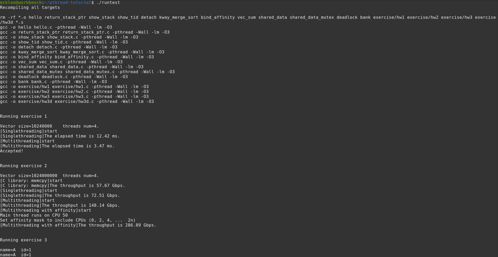
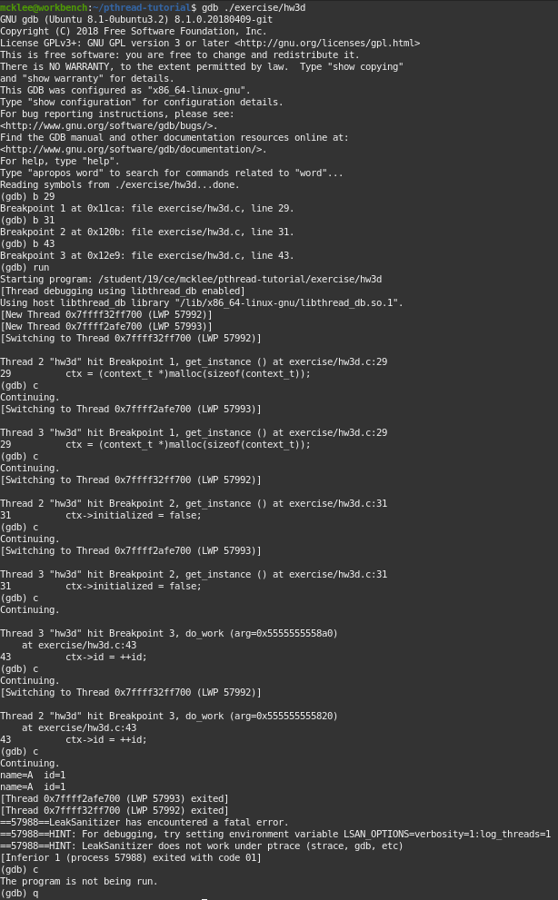

# COMP3230 Tutorial 3 Report

Lee Chun Kok Michael  
3035569110

## Screenshots

## Homework 3 Explaination

1. The bug is caused by an race condition in the code. The lack of any mutex 
   lock to guard the get_instance function causes the function to be invoked 2 
   times, which is shown by the fact that `get_instance()` breakpoint was 
   triggered 2 times in the gdb. 
2. An easy fix is to guard `get_instance()` with mutex lock at start and 
   unlock at end. However, it would slow down the code since there would be 
   overhead for 2 mutex lock and unlock. Therefore, I adapted the techique of 
   double-checked locking which in most situations will only require locking 
   of one time, hence reducing overhead. I used C11 atomic types to achieve a 
   proper implementation.

## Note

A online version of this code can be found at https://github.com/michaellee8/pthread-tutorial

